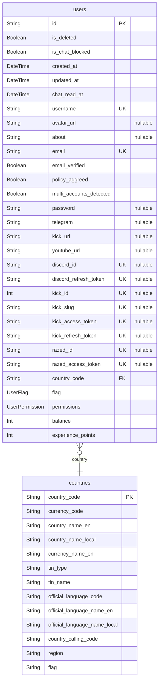

# ERD

> Generated by [`prisma-markdown`](https://github.com/samchon/prisma-markdown)

- [default](#default)

## default

### `countries`

Properties as follows:

- `country_code`:
- `currency_code`:
- `country_name_en`:
- `country_name_local`:
- `currency_name_en`:
- `tin_type`:
- `tin_name`:
- `official_language_code`:
- `official_language_name_en`:
- `official_language_name_local`:
- `country_calling_code`:
- `region`:
- `flag`:

### `users`

Properties as follows:

- `id`:
- `is_deleted`:
- `is_chat_blocked`:
- `created_at`:
- `updated_at`:
- `chat_read_at`:
- `username`:
- `avatar_url`:
- `about`:
- `email`:
- `email_verified`:
- `policy_aggreed`:
- `multi_accounts_detected`:
- `password`:
- `telegram`:
- `kick_url`:
- `youtube_url`:
- `discord_id`:
- `discord_refresh_token`:
- `kick_id`:
- `kick_slug`:
- `kick_access_token`:
- `kick_refresh_token`:
- `razed_id`:
- `razed_access_token`:
- `country_code`:
- `flag`:
- `permissions`:
- `balance`:
- `experience_points`:
